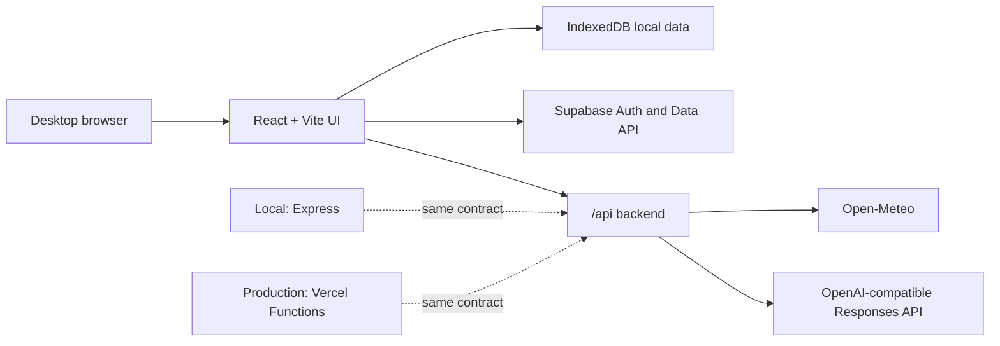

# Clothes Choosing 当前技术报告

报告日期：2026-07-13  
项目版本：`0.1.0`  
项目阶段：可运行原型，正在从本地优先向账号和跨浏览器同步演进

## 1. 项目目标

项目希望成为一个真实可每天使用的穿搭助手。输入包括：

- 用户衣柜中的衣服照片或文字描述
- 用户喜欢的穿搭图片或描述
- 当天实时天气
- 当天场合

当前输出是从已有衣柜中生成的最多 3 套搭配。推荐策略采用“两阶段检索”：先用结构化标签和确定性规则海选，再用兼容 OpenAI Responses API 的模型复排。

购买推荐、Calendar、Pinterest 和 Telegram 不属于当前已完成范围。

## 2. 当前完成度

| 模块 | 状态 | 说明 |
| --- | --- | --- |
| 衣柜录入 | 已实现 | 支持照片、描述、自动标签、手动修改和删除 |
| 喜欢的穿搭 | 已实现 | 支持图片/描述、风格提取和手动修改 |
| 天气 | 已实现 | Open-Meteo；支持城市地理编码和浏览器坐标 |
| 场合输入 | 已实现 | 7 个手动场合选项 |
| 标签海选 | 已实现 | 天气硬过滤、场合/风格/天气加权 |
| 候选组合 | 已实现 | `top + bottom + shoes`，按天气可加外套 |
| 模型复排 | 部分实现 | 已有 API 调用，但没有再次传入候选服装图片 |
| 本地持久化 | 已实现 | IndexedDB 和 JSON 备份导入/导出 |
| Supabase Auth | 代码已实现 | 邮箱 Magic Link、会话持久化、退出登录 |
| 跨浏览器同步 | 代码已实现，待完整验收 | 需要前端环境变量、已建表的 Supabase 项目和正确 RLS |
| Vercel 支持 | 已配置 | 有 Vite 构建配置和 Vercel Functions；本报告未验证线上环境变量和生产数据流 |
| 自动测试 | 基础覆盖 | 1 个测试文件、3 个测试，当前全部通过 |

## 3. 系统架构

前端是一个单页 React 应用，包含 `Today`、`Wardrobe`、`Style Likes` 和 `Settings` 四个视图。开发环境由 Express 提供 API；部署到 Vercel 时由 `api/` 中的 Serverless Functions 提供相同路径。

当前本地后端和 Vercel Functions 分别维护了一套 API 实现，能工作，但存在逻辑漂移风险。

## 4. 核心数据流

### 4.1 衣服录入

1. 浏览器把图片读取为 Data URL。
2. 前端把图片和可选描述发送到 `/api/model/tag-clothing`。
3. 服务端调用视觉模型，要求返回严格 JSON。
4. 用户可以修改模型生成的类别、颜色、天气、场合、风格、保暖和正式程度。
5. 保存时先写入 IndexedDB；如果用户已登录，再 upsert 到 Supabase。
6. 模型没有配置或调用失败时，服务端根据描述返回启发式 fallback 标签。

### 4.2 风格偏好

1. 用户上传喜欢的穿搭图片或输入描述。
2. `/api/model/extract-style` 提取 `styleTags` 和说明。
3. 所有喜欢记录的 `styleTags` 在前端聚合成偏好标签集合。
4. 推荐引擎用这些标签计算衣服与个人偏好的重合度。

### 4.3 今日推荐

1. 用户选择场合。
2. 应用根据手动城市或浏览器经纬度请求 `/api/weather`。
3. Open-Meteo 返回温度、体感温度、降水、风速和天气代码。
4. 规则引擎过滤明显不适合天气的衣服。
5. 引擎生成 `top × bottom × shoes` 的笛卡尔积，并在需要时加入最优外套。
6. 候选按规则分数排序，最多保留 3 套。
7. `/api/model/rank-outfits` 尝试复排；调用失败时保持规则排序。
8. 最终结果和当时天气快照被保存为推荐记录。

## 5. 推荐算法分析

### 5.1 硬过滤

当前天气过滤包括：

- 有降水时排除 `dry-only`
- 体感温度不高于 8°C 时排除 `hot`
- 体感温度不低于 27°C 时排除 `cold` 或保暖等级不低于 4 的衣服
- 体感温度不高于 12°C 时，排除保暖等级不高于 1 的非外套衣服

### 5.2 规则打分

每件衣服的主要加分项：

- 场合标签命中：`+8`
- 每个偏好风格标签命中：`+5`
- 雨天命中 `rain-ok`：`+4`
- 温度区间命中 `hot`、`mild` 或 `cold`：`+3`

雨天搭配里没有任何 `rain-ok` 物品时，会添加提示。

### 5.3 复杂度和约束

若上衣、下装和鞋分别有 `T`、`B`、`S` 件，当前候选生成复杂度约为 `O(T × B × S)`。小型个人衣柜可以接受，但衣服数量增大后需要先按单品分数截断每类候选，避免组合爆炸。

当前规则必须同时存在合适的上衣、下装和鞋。`onepiece` 不能替代上衣和下装，`accessory` 不参与组合。所有核心组合使用同一件当前评分最高的外套。

### 5.4 与目标方案的差距

视觉模型已经用于衣服打标签和喜欢穿搭的风格提取，但最终复排请求只包含：

- 候选 ID
- 规则分数
- 已生成的理由和提醒
- 天气、场合和偏好标签

请求没有携带候选衣服的图片、颜色、版型或完整单品标签。因此当前复排本质上是“基于规则输出的文本复排”，尚不能判断多件衣服放在一起是否真的视觉协调。这是下一阶段最重要的算法缺口。

## 6. 数据与同步

### 6.1 本地数据

IndexedDB 数据库名为 `local-outfit-assistant`，版本为 `1`，包含：

- `wardrobe`
- `likes`
- `recommendations`
- `settings`

目前图片没有放入独立 Blob store，而是以 Data URL 直接保存在对象的 `imagePreviewUrl` 字段。这样实现简单，也能随 JSON/云端记录一起移动，但会明显放大体积。

### 6.2 Supabase 数据

前端代码使用：

- `clothes_wardrobe_items`
- `clothes_liked_outfits`
- `clothes_recommendation_records`
- `clothes_user_settings`

前三类记录以业务 `id`、`user_id`、`data` JSON 和 `updated_at` 的形式读写；设置按用户保存。登录使用邮箱 OTP/Magic Link，浏览器负责持久化和刷新会话。

同步行为是“本地先写、登录后写云端”：

- 未登录时只读写 IndexedDB。
- 已登录时列表优先从 Supabase 读取，远端失败才回退到本地。
- 每次保存先写本地，再写远端。
- 登录事件会执行一次本地到云端的 upsert。

当前没有完整的双向合并、删除墓碑、版本号或冲突解决策略。新浏览器可以读取云端记录，但远端数据不会自动缓存回本地。若多个浏览器同时修改同一 ID，最后一次 upsert 生效。

### 6.3 当前配置状态

仓库中的 `.env.example` 已声明 Supabase URL 和 key 变量，但本地检查时没有 `.env` 或 `.env.local`，因此本机当前启动时云同步会处于未配置状态。Vercel 上的环境变量需要在部署平台单独核对。

仓库没有 Supabase migration 或 schema 文件。这意味着数据库结构和 RLS 目前是外部状态，无法仅靠克隆仓库完整复现。

## 7. 后端与外部服务

### 7.1 天气

天气服务不需要 API Key：

- 城市输入先调用 Open-Meteo Geocoding API。
- 经纬度或地理编码结果再调用 Forecast API 的 current weather。
- 浏览器定位只把经纬度传给本项目后端，不依赖 IP 猜测城市。

### 7.2 模型接口

服务端调用 `${MODEL_BASE_URL}/v1/responses`，使用 Bearer API Key。模型输入由文本 prompt 和可选 `input_image` 组成。

当前模型返回通过 `JSON.parse` 直接解析，没有 JSON Schema、字段白名单或运行时校验。无效类别、超范围数字、缺失数组或模型返回结构变化都可能进入前端状态。

### 7.3 本地与 Vercel

- 本地：`server/index.js` 提供 Express API，最大 JSON body 为 25 MB。
- Vercel：`api/` 目录下为函数入口，共享逻辑集中在 `api/_shared.js`。

两套实现存在重复代码。建议后续把通用 handler 和模型/天气逻辑提取为一个可同时被 Express 和 Vercel Functions 调用的模块。

## 8. 安全与隐私

已具备的保护：

- 模型 API Key 只从服务端环境变量读取。
- `.env` 和 `.env.local` 被 Git 忽略。
- Supabase 前端只需要 publishable/anon key，实际用户身份由登录 JWT 表示。
- 用户未登录时衣柜只保存在当前浏览器。

需要持续确认的事项：

- Supabase 所有暴露表必须启用 RLS，并用 `auth.uid() = user_id` 同时限制读写。
- 不得把 secret 或 `service_role` key 放进任何 `VITE_*` 变量。
- 目前图片会作为 Data URL 发给模型并写入本地/云端记录，缺少压缩、尺寸限制、类型校验和 EXIF 清理。
- 模型端能够看到用户上传的衣服和喜欢穿搭图片，产品界面应补充清晰的隐私说明。
- Supabase 项目的允许重定向 URL 需要同时覆盖本地地址和生产域名。

## 9. 测试与质量状态

2026-07-13 本地执行结果：

- `npm test`：通过
- 测试文件：1
- 测试用例：3
- 覆盖内容：雨天过滤、场合/风格偏好、最多 3 套且只使用衣柜内 ID

当前没有覆盖：

- React 交互和表单
- IndexedDB 导入/导出
- Supabase Auth、RLS 和同步冲突
- 天气 API 错误和定位拒绝
- 模型返回异常数据
- Express/Vercel API 合约一致性
- 端到端推荐流程

## 10. 主要风险与技术债

按优先级排序：

1. 最终视觉复选尚未实现，模型看不到候选服装图片。
2. Supabase schema 未纳入迁移，项目不能从仓库完全复现。
3. 图片以 Data URL 存进 JSON/数据库，容量、速度和成本会快速恶化。
4. 云同步没有可靠的双向合并和冲突策略。
5. 模型输出没有运行时 schema 校验。
6. 组合算法没有使用颜色、正式程度、季节、配饰和连衣裙。
7. 本地 Express 与 Vercel Functions 存在重复实现。
8. 自动测试只覆盖推荐引擎的最小路径。

## 11. 建议路线图

### P0：把当前云同步变成可复现、可验收

- 添加 Supabase migration，包含表、索引、授权和 RLS policy。
- 在本地和 Vercel 配置 publishable key，验证 Magic Link 回跳。
- 用两个浏览器完成新增、登录、同步、删除和重新加载验收。
- 给同步增加明确状态和失败重试。

### P1：完成真正的视觉复选

- 候选中携带完整单品元数据。
- 为每套候选构建小尺寸 contact sheet，或把各单品图片作为多张输入图传给视觉模型。
- 用结构化输出约束模型只能返回已有候选 ID。
- 保留规则分数作为可解释先验，并记录模型复排前后的变化。

### P1：改造图片存储

- 上传前压缩和移除不需要的元数据。
- 本地使用独立 Blob store。
- 云端使用 Supabase Storage，数据库只保存对象路径和缩略图信息。
- 给每个用户配置私有 bucket policy 和签名访问方式。

### P2：增强穿搭质量

- 增加颜色协调、正式程度目标、季节和重复穿着惩罚。
- 支持 `onepiece + shoes`、配饰和多层搭配。
- 记录用户“穿了/没穿/不喜欢”的反馈，形成个人权重。
- 在衣柜不足时识别真正缺口，再进入购买推荐，而不是泛泛推荐商品。

### P3：外部入口

- Calendar 自动提供场合和日程强度。
- Telegram 作为快速询问、反馈和提醒入口。
- Pinterest 作为风格参考导入源。
- 购买推荐只针对衣柜缺口，并把预算、品牌、尺码和退货条件纳入筛选。

## 12. 阶段结论

当前项目已经打通“录入衣柜 → 生成/修改标签 → 获取实时天气 → 规则组合 → 模型复排 → 保存结果”的主流程，适合作为可交互原型继续迭代。规则优先、模型辅助的总体架构是合理的，也能在模型不可用时保持基本功能。

要进入真正可每天依赖的版本，最先应完成 Supabase 可复现部署和跨浏览器验收，然后让最终复排真正看到候选图片。完成这两点后，再扩展 Calendar、Telegram 和购买推荐会更稳。
